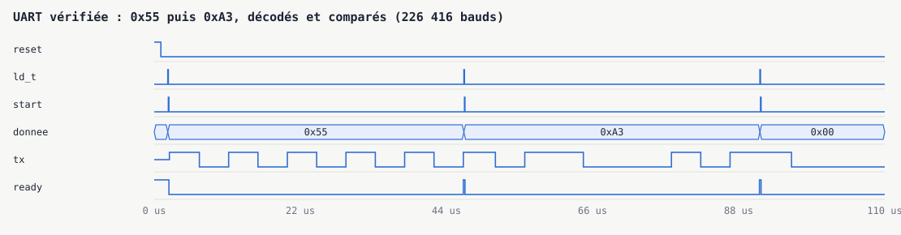
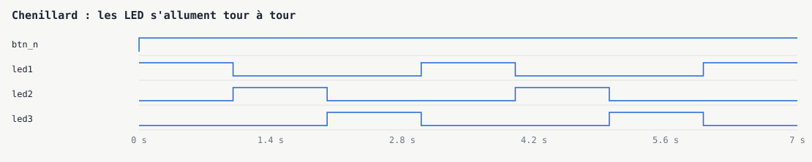
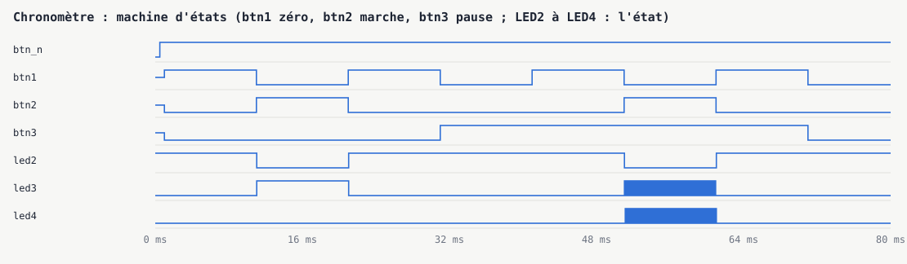

# FPGA : périphériques en VHDL sur iCEBreaker

[](https://github.com/rivaldopiaplle-boop/git_fpga-vhdl-icebreaker/actions/workflows/ci.yml)

Travaux de conception matérielle en VHDL sur la carte iCEBreaker (FPGA Lattice iCE40
UP5K, horloge 12 MHz), du comparateur au périphérique UART complet, chaque module avec
son banc de test.

Portfolio : https://git-portfolio-rivaldo.vercel.app/projets/fpga-vhdl-icebreaker

## Vérifié à chaque poussée

La chaîne GitHub Actions fait, sans carte ni logiciel propriétaire :

1. **Simulation** de chaque banc de test sous GHDL (`tests/simuler.sh`).
2. **Vérification automatique de l'UART** (`tests/uart_verif_tb.vhd`) : un banc de test
   joue le rôle du PC branché sur la liaison série, décode la ligne TX et compare, par
   des assertions, chaque octet reçu à l'octet envoyé. Une assertion en échec fait
   échouer la chaîne ; un design volontairement faussé (données inversées) est bien
   rejeté.
3. **Chronogrammes** tracés en SVG depuis les traces VCD (`tests/chronogramme.py`),
   sans GTKWave.
4. **Synthèse pour la vraie puce** (`tests/synthetiser.sh`) : GHDL et Yosys, placement
   et routage par nextpnr, fichier de programmation par icepack.

| Module | Cellules logiques (sur 5 280) | Horloge maximale | Simulation |
|---|---|---|---|
| `cmp_1bit` | 6 | combinatoire | 5 ms |
| `chenillard` | 86 | 57 MHz | 7 s |
| `chronometre` | 194 | 75 MHz | 80 ms |
| `peripherique_UART` | 74 | 96 MHz | 250 ms |
| `peripherique_UART2` | 58 | 92 MHz | 250 ms |
| `uart` | 54 | 99 MHz | 15 ms, et vérification par assertions |

Tous tiennent largement dans la puce et au-delà des 12 MHz de la carte.

```bash
# En local, sans rien installer d'autre que Docker et Python :
docker run --rm -v "$PWD":/src -w /src ghdl/ghdl:ubuntu22-mcode bash tests/simuler.sh
bash tests/chronogrammes.sh
```

## Les chronogrammes

**UART vérifiée** : 0x55 puis 0xA3 chargés, envoyés, puis décodés sur TX.



**Chenillard** : les trois LED s'allument tour à tour.



**Chronomètre** : la machine d'états (remise à zéro, marche, pause).



## Ce que la simulation a montré

- **Le débit réel de l'UART est de 226 416 bauds**, pour 230 400 visés : un bit dure
  53 cycles d'horloge (52 d'attente, comparés à `x"33"`, plus 1 de décalage), au lieu
  de 52. L'écart de 1,7 % reste dans la tolérance d'une liaison série ; comparer à
  `x"32"` donnerait 52 cycles, soit 230 769 bauds (0,2 % d'écart).
- **Chronomètre : marche et pause pressés ensemble font osciller l'état à chaque cycle**
  (visible sur le chronogramme, entre 48 et 60 ms). Il manque une priorité entre les
  deux boutons, comme celle déjà donnée à la remise à zéro.
- **`MicroPDM` ne compile pas** : son design est inachevé (erreurs de syntaxe aux lignes
  144 à 180). Il est exclu de la simulation et de la synthèse.

La simulation du chenillard réduit ses diviseurs par mille, sur une copie des sources et
avec les valeurs que l'auteur avait notées en commentaire : les fichiers du dépôt gardent
celles de la carte.

## Ce que contient le dossier

| Dossier | Contenu |
|---|---|
| `VHDL/cmp_1bit/` | Comparateur 1 bit : premier module et son banc de test |
| `VHDL/chenillard/` | Chenillard sur les LED |
| `VHDL/chronometre/` | Chronomètre : compteurs cascadés, machine d'états, afficheur 7 segments |
| `VHDL/peripherique_UART/` | Transmission UART |
| `VHDL/peripherique_UART (copie 1)/` | Une autre version du même périphérique |
| `VHDL/peripherique_UART2/` | UART complet : générateur de débit, émission |
| `VHDL/MicroPDM/` | Acquisition d'un microphone PDM (inachevé) |
| `uart/` | Version isolée du module UART, celle que vérifie la chaîne |
| `tests/` | Simulation, vérification, chronogrammes, synthèse |
| `chronogrammes/` | Les chronogrammes en SVG |

Chaque dossier contient `icebreaker.vhd` (le design), `icebreaker_tb.vhd` (le banc de
test), `broches.pcf` (le brochage de la carte) et les scripts d'origine `simu.sh` et
`build_fpga.sh`.
